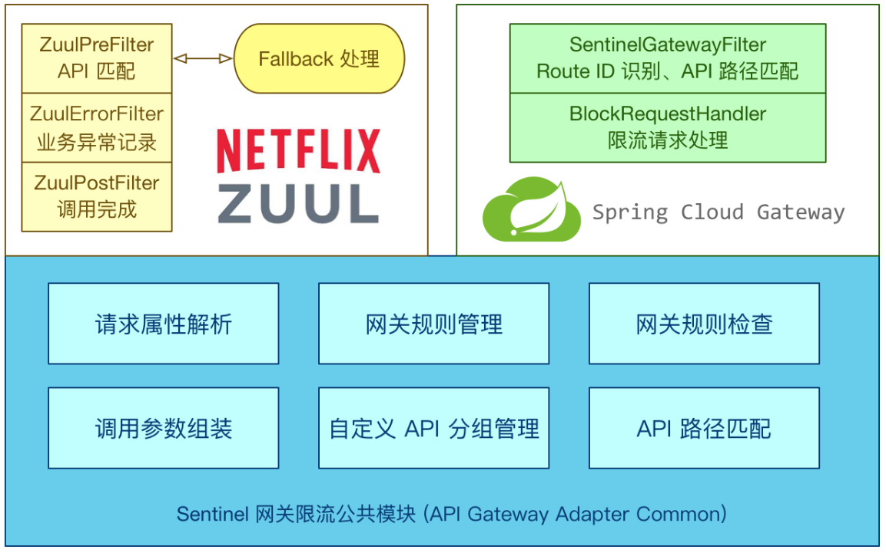

# 网络攻击与防御实验报告

- 1951976 李林飞


## 1. hping3攻击

- Vagrant+VirtualBox安装kali

```shell
vagrant init kalilinux/rolling
vagrant up
```

【这界面也太好看啦！！】


> hping3 是一种网络工具，能够发送自定义 ICMP/UDP/TCP 数据包并显示目标回复，就像 ping 对 ICMP 回复所做的那样。它处理碎片和任意数据包主体和大小，并可用于在支持的协议下传输文件。使用 hping3，您可以测试防火墙规则、执行（欺骗）端口扫描、使用不同协议测试网络性能、进行路径 MTU 发现、在不同协议下执行类似 traceroute 的操作、指纹远程操作系统、审计 TCP/IP 堆栈等。

- DDos攻击

```shell
hping3 -S  --flood --rand-source -p  8080  xx.xxx.81.118
```


> - -S 表示发送的是SYN包。
>   这里涉及到TCP的三次握手，客户端与服务器要建立连接，首先要先由客户端向发服务器发送一个SYN包请求连接，服务器收到客户端发来的SYN包后会回复一个SYN+ACK包表示可以进行连接，之后客户端再发送一个SYN+ACK包，当这个包发送完成之后，客户端和服务器的连接就算成功了。因此，这个参数导致的结果时向服务器发送SYN包却不对返回的SYN+ACK包进行回应，使服务器保持在一种"半连接"在状态
>
> - –flood 表示以洪水的方式发送，就是拼了命地发
>
> - –rand-source 是指定随机来源，意思是假装有很多台主机要和服务器连接，实际上这些主机IP都是伪造的
>
> - -p 80 指定端口号为80
>
> - [hostname/ip] 目标服务器的主机名或是IP地址啦
>
> - 由于设置了随机来源，所以我们并不会收到服务器的回应，因此我们看不到任何的回显。当然，如果没有使用-rand–source的话，就可以看到服务器的回应了不过，这样服务器当然也就知道发起攻击的是谁了

- 攻击效果


## 2.防御

### 2.1 防火墙端

> - 将恶意IP加入黑名单
> - 只允许信任用户IP加入白名单
> - 自动识别异常流量，并将异常IP加入黑名单


```shell
[root@AlbionCloud /]# sudo ufw status
Status: inactive
```

- 开启防火请

```shell
sudo ufw enable

[root@AlbionCloud /]# sudo ufw status
Status: active

To                         Action      From
--                         ------      ----
SSH                        ALLOW       Anywhere                  
224.0.0.251 mDNS           ALLOW       Anywhere                  
80                         ALLOW       Anywhere                  
SSH (v6)                   ALLOW       Anywhere (v6)             
ff02::fb mDNS              ALLOW       Anywhere (v6)             
80 (v6)                    ALLOW       Anywhere (v6) 

```


- 开放8080端口与禁用端口

```shell
# 禁用8081端口
sudo ufw delete allow 8081
# 开启8080端口
sudo ufw allow 8080
```


### 2.2 Web服务器端(Nginx和Tomcat)

> - 限制接口的访问频率，文件下载速率
> - 限制TCP连接数，连接时长
> - 配置定制化的网络参数限制恶意攻击
> - Nginx负载均衡

#### 2.2.1 负载均衡配置

在docker中部署Ningx的Vue项目。

- Dockerfile

```shell
FROM nginx:stable-alpine
COPY dist/ /usr/share/nginx/html
EXPOSE 80
CMD ["nginx","-g","daemon off;"]
```

- 打包

```shell
sudo docker built -t hcss-vue:2.0 .
```

- Nginx集群

```
sudo docker run -p 8080:80 -d --name hcss-vue hcss-vue:2.0
```


```shell
docker cp hcss-vue:/etc/nginx ~/conf

docker cp hcss-vue:/usr/share/nginx/html ~/html
```


```shell
docker run -d -it -p 8080:80 --name hcss-vue8080 -v ~/conf:/etc/nginx -v ~/html:/usr/share/nginx/html nginx:latest
```

- 复制l三个配置文件,再起三个nginx容器

```shell
docker run -d -it -p 8081:80 --name hcss-vue8081 -v ~/conf1:/etc/nginx -v ~/html1:/usr/share/nginx/html nginx:latest

docker run -d -it -p 8082:80 --name hcss-vue8082 -v ~/conf2:/etc/nginx -v ~/html2:/usr/share/nginx/html nginx:latest

docker run -d -it -p 8083:80 --name hcss-vue8083 -v ~/conf3:/etc/nginx -v ~/html3:/usr/share/nginx/html nginx:latest
```


- 配置网络

```shell
docker network ls
```


```shell
docker network inspect d5
```


选择8080作为主服务器,修改配置

```shell
sudo vi conf/conf.d/default.conf 
```

```shell
upstream 172.17.0.3 {
	server 172.17.0.5 weight=1; # 8082
	server 172.17.0.4 weight=2; # 8081
	server 172.17.0.6 weight=2; # 8083
}


server {
    listen       80;
    listen  [::]:80;
    server_name  172.17.0.3;

    #access_log  /var/log/nginx/host.access.log  main;

    location / {
	proxy_pass http://172.17.0.3;
	proxy_set_header Host $host;
        proxy_set_header X-Real-IP $remote_addr;
        proxy_set_header X-Forwarded-For $proxy_add_x_forwarded_for;
    }

    #error_page  404              /404.html;

    # redirect server error pages to the static page /50x.html
    #
    error_page   500 502 503 504  /50x.html;
    location = /50x.html {
        root   /usr/share/nginx/html;
    }

    # proxy the PHP scripts to Apache listening on 127.0.0.1:80
    #
    #location ~ \.php$ {
    #    proxy_pass   http://127.0.0.1;
    #}

    # pass the PHP scripts to FastCGI server listening on 127.0.0.1:9000
    #
    #location ~ \.php$ {
    #    root           html;
    #    fastcgi_pass   127.0.0.1:9000;
    #    fastcgi_index  index.php;
    #    fastcgi_param  SCRIPT_FILENAME  /scripts$fastcgi_script_name;
    #    include        fastcgi_params;
    #}

    # deny access to .htaccess files, if Apache's document root
    # concurs with nginx's one
    #
    #location ~ /\.ht {
    #    deny  all;
    #}
}
```

- 配置完成以后进入主服务器容器 重启服务器

```shell
 docker exec -it hcss-vue8080 bash
 
[root@AlbionCloud ~]#  docker exec -it hcss-vue8080 bash
root@1d560790991b:/# service nginx restart
```

- 完成后退出,然后分别修改三台从服务器的html内容

```shell
[root@AlbionCloud ~]# echo 8081 >html1/index.html
[root@AlbionCloud ~]# echo 8082 >html2/index.html
[root@AlbionCloud ~]# echo 8083 >html3/index.html
```

- 测试

```shell
[root@AlbionCloud ~]# curl 172.17.0.3
8081
[root@AlbionCloud ~]# curl 172.17.0.3
8083
[root@AlbionCloud ~]# curl 172.17.0.3
8082
[root@AlbionCloud ~]# curl 172.17.0.3
8081
[root@AlbionCloud ~]# curl 172.17.0.3
8083
[root@AlbionCloud ~]# curl 172.17.0.3
8081
[root@AlbionCloud ~]# curl 172.17.0.3
8083
[root@AlbionCloud ~]# curl 172.17.0.3
```

- 修改为html1/html2/html3为html中的内容，访问页面


#### 2.2.2 DDos攻击防御效果

- 攻击8080端口

> DDos攻击：
>
> ```shell
> hping3 -S  --flood --rand-source -p  8080  xx.xxx.81.118
> ```

在没有配置Nginx负载均衡时，服务器直接无法响应请求，当使用Nginx负载均衡，可以发现静态资源可以正确响应，但大量攻击导致服务器无法处理动态资源。


- 打开8081端口防火墙，由于负载均衡，该端口可以正确浏览界面

使用hping3发动对8080端口的攻击，浏览8081端口，攻击效果


### 2.2.3 应用后端– 高并发秒杀模拟系统设计

负载均衡（Load Balance）是分布式系统架构设计中必须考虑的因素之⼀，它通常是指，将请求/数据均匀分摊到
多个操作单元上执⾏，负载均衡的关键在于均匀。 负载均衡建⽴在现有⽹络结构之上，它提供了⼀种廉价有效透明
的⽅法扩展⽹络设备和服务器的带宽、增加吞吐量、加强⽹络数据处理能⼒、提⾼⽹络的灵活性和可⽤性。

> - 在应用层面对可以用户进行限制，对重要接口访问做限流
> - 使用缓存来提高吞吐率

- github仓库：https://github.com/lif314/High_Concurrency_System_Simulation

#### 1. 架构图


#### 2. hcss-vue


#### 3. RabbitMQ


#### 4. Sentinel


**流量控制**

- 并发线程数流量控制：线程数限流用于保护业务线程数不被耗尽。例如，当应用所依赖的下游应用由于某种原因导致服务不稳定、响应延迟增加，对于调用者来说，意味着吞吐量下降和更多的线程数占用，极端情况下甚至导致线程池耗尽。为应对高线程占用的情况，业内有使用隔离的方案，比如通过不同业务逻辑使用不同线程池来隔离业务自身之间的资源争抢（线程池隔离），或者使用信号量来控制同时请求的个数（信号量隔离）。这种隔离方案虽然能够控制线程数量，但无法控制请求排队时间。当请求过多时排队也是无益的，直接拒绝能够迅速降低系统压力。Sentinel线程数限流不负责创建和管理线程池，而是简单统计当前请求上下文的线程个数，如果超出阈值，新的请求会被立即拒绝。

- QPS流量控制：当 QPS 超过某个阈值的时候，则采取措施进行流量控制。

**熔断降级**

除了流量控制以外，对调用链路中不稳定的资源进行熔断降级也是保障高可用的重要措施之一。一个服务常常会调用别的模块，可能是另外的一个远程服务、数据库，或者第三方 API 等。例如，支付的时候，可能需要远程调用银联提供的 API；查询某个商品的价格，可能需要进行数据库查询。然而，这个被依赖服务的稳定性是不能保证的。如果依赖的服务出现了不稳定的情况，请求的响应时间变长，那么调用服务的方法的响应时间也会变长，线程会产生堆积，最终可能耗尽业务自身的线程池，服务本身也变得不可用。


**网关流控**



**来源访问控制**

很多时候，我们需要根据调用方来限制资源是否通过，这时候可以使用 Sentinel 的黑白名单控制的功能。黑白名单根据资源的请求来源（`origin`）限制资源是否通过，若配置白名单则只有请求来源位于白名单内时才可通过；若配置黑名单则请求来源位于黑名单时不通过，其余的请求通过。

#### 5. Redis


#### 6. k8s集群


网络攻击&压力测试：

- 网络攻击比如DDos是发送请求，服务器不需要进行业务处理
- 压力测试：需要进行业务处理的业务请求


DDos攻击只针对服务器，因此攻击不会蔓延到攻击服务器关联的服务器。如果模拟正确请求，则可以在短时间内向系统发送大量的请求，进而导致系统数据库等崩溃。


## 参考资料

- Ubuntu ufw：https://www.cnblogs.com/sweet521/p/5733466.html
- Docker+Nginx集群：https://zhuanlan.zhihu.com/p/157183707
- Kali教程：https://wizardforcel.gitbooks.io/daxueba-kali-linux-tutorial/content/index.html

- Vagrant Cloud：https://app.vagrantup.com/boxes/search
- Sentinel：https://sentinelguard.io/zh-cn/docs/introduction.html
- Kali官网：https://www.kali.org/docs/
- hping3文档：https://www.kali.org/tools/hping3/

- Kali渗透攻击：https://blog.51cto.com/tar0cissp/1723491